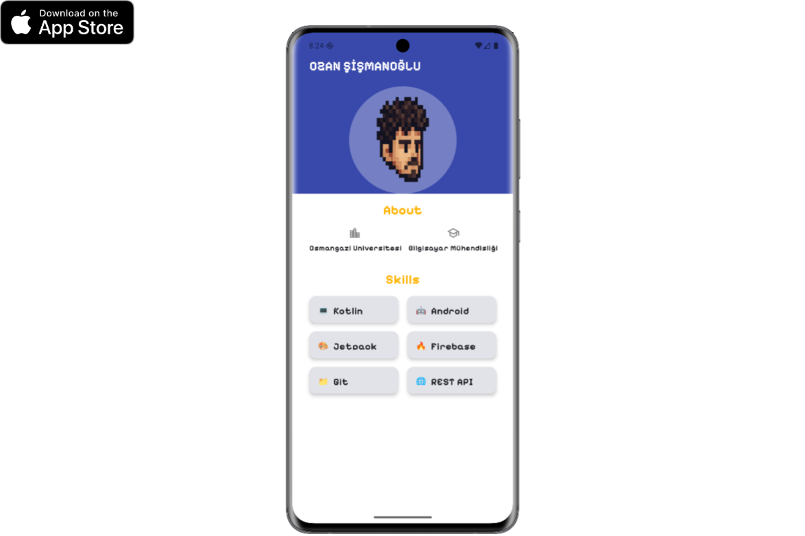

# Profil Kartı Uygulaması

Jetpack Compose ile yapılmış basit bir profil kartı tasarımı.

## 📱 Özellikler

- ✅ Kullanıcı adı ve profil görseli
- ✅ Eğitim ve meslek bilgileri
- ✅ Yetenekler (Skills) listesi
- ✅ Modern ve renkli tasarım


## 🖼️ Ekran Görüntüsü

<p align="center">
  
</p>

## 🛠️ Kullanılan Teknolojiler

- Kotlin
- Jetpack Compose
- Material Design 3
- Android SDK

## 📦 Kurulum

1. Projeyi klonlayın veya indirin
```bash
git clone https://github.com/Ozansis/turkcell-gygy5-android-profile-design.git
```

2. Android Studio'da açın
3. Gradle sync yapın
4. Uygulamayı çalıştırın

